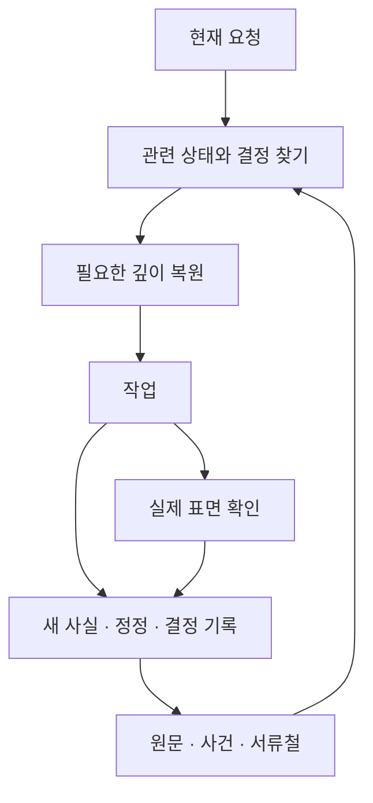
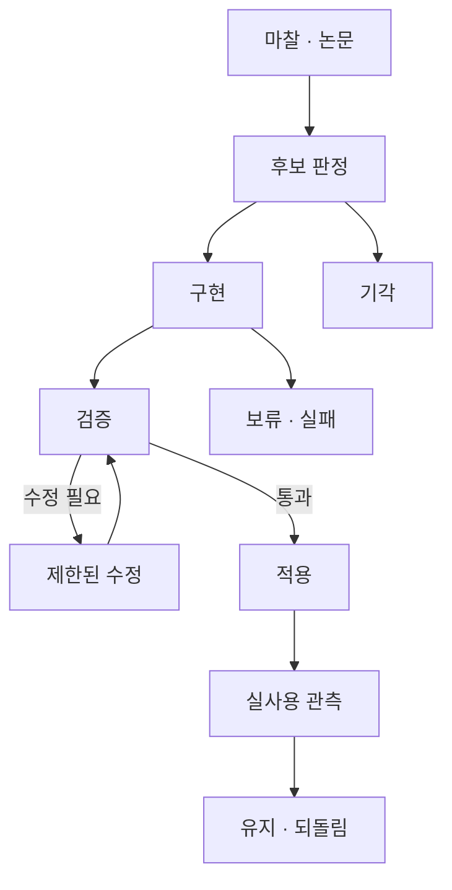

# PRD — 작업을 이어 가고 개선하는 기억

> **상태: 현행 엔진 요구, 2026-10-08 개정.** 구현 완료 선언이 아니다. 미충족과 관측 방법은 `design-memory-runtime.md#verification`에 둔다.
> 한국어 정본은 이 `.ko.md`다. 영어 `.md`는 이 정본에 내용 hash로 결속된 번역이다.
> 역할: 새 세션·깊은 복귀·자율 개선에서 사용자에게 무엇을 보장해야 하는가.
> 주장 권위와 데이터 경계는 `PRD-info-architecture.ko.md`, 기술 구조는 `design-memory-runtime.md`가 소유한다.

## 1. 사용자에게 필요한 세 장면

**새 세션.** 무엇을 진행 중이고 무엇을 결정했는지 다시 설명하지 않아도 다음 일을 시작한다. local 상태가 없으면 없다고 표시하며, 공유 상태만으로 전체를 안다고 하지 않는다.

**깊은 복귀.** 다른 일을 하다가 돌아와도 이전 결론, 그 이유, 기각한 대안, 미결을 복원한다. 서류철을 읽었다고 끝내지 않고 현재 답과 행동에 반영한다.

**자율 개선.** 반복 마찰과 새 연구를 검토해 작은 변경을 시험하고, 결함을 고쳐 재검증하며, 실제 도움이 됐는지 다시 본다. 사람이 매번 시작·진행·완료를 확인해 주지 않아도 이 고리가 이어진다.

목적은 필요한 일을 완료하는 동안 사용자의 재개·판단·행동 비용을 줄이는 것이다. 더 많은 기억, 워커, 논문, 채택, 규칙은 각각 목적이 아니다.

## 2. 대화에서 결과까지

기억은 현재 질문에 답하기 위한 근거다. 자동 주입은 존재를 알리는 작은 시작점이고, 원문과 서류철은 필요할 때 읽는다. 광역 독해와 검증은 격리된 작업자가 맡고, 사람과 주 세션에는 판단에 필요한 결과와 근거 위치가 돌아온다.

## 3. 상태와 깊이를 복원한다

상태 정본은 public NOW와 local private overlay를 합친 view다. 시작·재개·컴팩션 후 실제로 받은 view를 확인한다. 주입 실패 시 디스크를 읽는 경로가 남아 있어야 한다. local이 없으면 `unavailable`, 일부 오류면 `degraded`, 손상이면 그 사실을 드러낸다. 생성 시각과 원본 신선도는 다르다.

합친 view는 현재 상태를 위한 파생물이며 모든 주장에 대한 최상위 근거가 아니다. 원문 귀속·현재 결정·실행 사실의 권위는 정보 PRD를 따른다.

깊은 스레드마다 정본 서류철 하나를 지정한다. 기존 문서를 재사용할 수 있다. 서류철은 현재 위치, 확정과 이유, 기각과 이유, 미결, 다음 수를 담고 근거로 돌아갈 수 있어야 한다. 복귀 시 이를 읽고 필요하면 원문을 조회한다. 떠날 때는 델타 5줄 이내를 덧붙이되, 중요한 결정·정정을 마감까지 미루지는 않는다.

## 4. 현재 질문에 필요한 기억을 고른다

회상은 키워드·시간·화자·프로젝트와 원문 위치를 이용한다. 복제된 하위 에이전트 이력, 시스템 주입, 컴팩션 요약을 사용자 원문으로 승격하지 않는다. 검색 범위와 제외 조건을 알 수 있어야 한다.

과거 발화 자체가 쟁점이면 원문을 읽는다. 현재 작업에 필요한 근거를 가져오고, 무관한 전체 기록을 항상 주입하지 않는다. 반대로 전수 검토가 요구된 작업을 표적 검색 몇 번으로 완료했다고 하지 않는다. `읽었다`, `찾았다`, `판단에 썼다`는 서로 다른 주장이다.

상시 규칙은 중요한 경계와 재개 동작에 집중하고 나머지는 조건부로 읽는다. 현행 7개는 운용 기본값이며 모든 모델의 보편 능력 상한을 뜻하지 않는다. 규칙을 추가할 때에는 막을 실패와 기존 규칙의 중복을 확인한다. 형식상 불릿 수를 줄여도 독립 의무가 줄었다고 간주하지 않는다.

lexical 검색의 알려진 실패를 먼저 재현하고, 임베딩·그래프·재랭킹 등은 같은 질의와 읽기 예산에서 비교한다. 기존 재검토 조건인 known-item 실패 3건, 표현 불일치 실증, 응답성 저하, 교차 연결 비용 증가는 유지한다. 조건이 발동했다는 사실은 새 방식을 자동 채택할 이유가 아니다.

## 5. 자율 개선은 결과까지 닫는다

자동 집행은 각 인스턴스가 명시적으로 위임한 범위에서만 한다. 엔진 설치나 이 PRD 채택만으로 집행 권한이 생기지 않는다. 이 킷은 아래 개선 계약을 정의하지만 주간 정원·논문 적용기를 기본 설치하지 않는다. 자동 집행을 추가할 때에는 소유자가 허용 경로·보호 경로·중단 조건·로컬 커밋 여부를 인스턴스 규칙에 기록해야 한다. 위임이 없으면 제안·검토에서 멈춘다. `wf_gardener.js` 같은 report-only 도구가 다른 루프의 실행 권한을 물려받지 않는다.

한 후보에는 바꾸려는 실제 실패, 기대되는 행동 변화, 비교 기준, 중단 조건, 되돌릴 단위, 재관측 시점이 있어야 한다. 새 논문의 점수는 우리 작업의 효과 증거를 대신하지 않는다. 사고렌즈는 가정과 반례를 드러내는 데 사용하고, 절 제목의 존재를 사고 품질 PASS로 세지 않는다.

아래 상태는 구별해야 한다.

| 상태 | 의미와 다음 행동 |
|---|---|
| 아이디어 기각 | 가치·범위·증거가 부족해 하지 않는다. 이유와 재개 조건을 남긴다 |
| 구현 수정 필요 | 목표는 유효하나 패치·산출·테스트·리뷰에서 고칠 결함이 있다. 같은 명세 안에서 피드백을 반영한다 |
| 증거 부족·실행 보류 | 실행 조건이나 검증이 부족하다. 통과로 표시하지 않고 조건이 풀릴 때 재개한다 |
| 수정 예산 소진 | 정해 둔 시도·시간 안에 해결하지 못했다. 실패를 남기며 아이디어 자체의 기각과 구별한다 |
| 적용 | 특정 버전의 패치가 검증과 권한 경계를 통과해 반영됐다 |
| 효과 확인·효과 미확인 | 실제 작업에서 도움이 됐는지 관측했다 또는 아직 모른다 |

**수정 계약:** 같은 명세·write-set의 구현 시도는 **최초 1회와 피드백 수정 1회, 합계 최대 2회**다. 시도 이력과 소진 상태를 보존하며 런타임이 예산을 늘리거나 같은 명세를 새 후보로 포장해 다시 시작하지 않는다. 목적·범위 변경은 별도 판정이며 기존 시도 실패를 지우지 않는다. 리뷰를 통과시키려고 평가 기준을 낮추지 않는다. 최신 base와 패치에 결속된 검증 없이 이전 PASS를 재사용하지 않는다. 적용 후 효과가 없거나 손해가 관측되면 유지·수정·되돌림을 판단한다.

채택 0도 정당한 결과다. 하지만 후보가 없었던 것과 구현이 전부 실패한 것은 다르다. 발견→선택→구현→검증→적용→실사용의 단계별 결과와 원인을 함께 본다. 채택 할당량을 두지 않는다. 주기가 종료됐다는 것과 개선됐다는 것을 별도로 보고한다.

## 6. 실패와 사람에게 넘기는 조건

복구·상태 안내가 실패해도 가능한 작업은 이어가고 부족한 관측을 표시한다. 비공개 반출이나 허용되지 않은 변경을 막는 경계는 실패 시 차단한다. 모든 훅에 같은 실패 정책을 붙이지 않는다.

감시자를 설치하는 인스턴스에서는 프로세스 등록·종료코드만 보지 않고 필요한 산출과 다음 단계로의 전달을 확인한다. 재시도는 중복 실행·무한 반복을 막고, 감시자 자체가 고장 나도 발견 가능한 증거를 남긴다. `--help`와 명시적인 조회 명령은 상태 변경이나 치유 실행을 일으키지 않아야 한다.

사람에게 넘길 때에는 막힌 결정 하나, 준비한 대안, 현재 권고, 답에 따라 달라질 일을 묶는다. 이미 위임된 작업을 다시 승인받지 않는다. 사람이 필요 없는 가역적 구현·검증은 계속한다. 관련 없는 운영 경고를 모두 사용자에게 덤프하지 않는다.

## 7. 완료와 효용을 따로 검증한다

| 검증할 주장 | 필요한 관측 |
|---|---|
| 기록이 보존됐다 | 실제 기록과 대체 관계, scope·원점의 유효성 |
| 필요한 근거를 찾았다 | 알고 있는 정답 자료·표현 변이·시간 충돌 질의의 결과 |
| 세션에 전달됐다 | 실제 런타임의 주입 경로, 켠 경우와 끈 경우 비교 |
| 응답·행동이 달라졌다 | 같은 실제 과업에서 제약·기각 이유·정정이 반영됐는지 |
| 일이 더 나아졌다 | 재설명·재작업·판단 부담·완료 결과의 후속 관측 |

기존 성공 기준인 새 세션 상태 질문 3개 복구·재질문 0, 알려진 낡은 단언 재현 탐지, 상태 수동 갱신 집 5→2, 서류철로 이전 깊이 복원, 의식 원가 툴콜 1회, public NOW와 SessionStart 각각 6,000 UTF-8 bytes, worker receipt 4,096 UTF-8 bytes는 유지한다. 실제 통과 여부는 대상 버전과 관측으로 확인한다. 문서의 '구현됨'이나 과거 감사표만으로 현재 통과를 선언하지 않는다.

사람용 지도는 60초 안에 “지금 내가 할 일”, “어디가 막혔는지”, “어떤 근거를 확인할지”를 보여줘야 한다. 상태에는 관측 시각·근거·미지를 붙인다. 생성된 그림도 하드코딩된 설명과 실제 관측을 구별하며, 생성됐다는 이유로 정합성을 보증하지 않는다.

복구·검색·주입·행동·실효는 해당 인스턴스의 현재 버전에서 각각 관측한다. 비교 증거가 없으면 UNKNOWN이다. 구현된 부분의 테스트와 아직 미관측인 사용자 효용을 각각 표시하며 기존 목표를 현재 구현 수준으로 낮추지 않는다.

## 10.5 fresh bounded worker (KIT-DR-007)

이 절은 기존 문서·DR의 byte/capability 참조를 위한 **현행 계약**이다. 구현 설명은 `design-memory-runtime.md#worker`에 둔다.

- 광역 독해·감사·런타임 토론은 fresh+ephemeral worker로 격리한다. resume·runtime fallback·public trace landing·write-capable Claude를 제공하지 않는다. worker 자체는 스케줄러를 소유하지 않는다.
- 주 세션 반환 receipt는 **4,096 UTF-8 bytes 이하**다. 정확한 prompt snapshot, event stream, stderr, final result와 content hash는 `_private/work/runs/`의 자기완결 run record에 남긴다. native session persistence는 0이다.
- Claude capability는 **read-only (`Read|Glob|Grep`)**, Codex는 **workspace-write sandbox**다. capability를 receipt와 meta에 표시한다. Claude가 편집안을 출력하는 것과 파일 쓰기 권한을 가지는 것은 다르다. 상태·발송·커밋은 dispatcher의 권한이다.
- 두 adapter는 connector·web·command network·사용자 plugin·fan-out을 닫고 hook에 의존하지 않는다. dispatch가 AGENTS와 필요한 public/local 정본 경로를 명시한다. Claude는 safe mode·strict empty MCP config, Codex는 user config 무시와 기능 차단을 사용한다.
- meta v2는 `kit_rev`·`kit_rev_source`·`repo_rev`·`kit_dirty`·`engine_sha256`·`kit_sync`·`agents_sha256`·`harness_sha256`·`usage`·`read_scope`·`scope`를 기록한다. usage 부재는 null, write-set 확인 부재는 unchecked다. 범위 위반이 run status를 바꾸는 조건은 `--strict-scope`다. 사후 탐지를 사전 차단으로 말하지 않는다.
- 파도 집계 receipt는 최대 8개 run을 입력 순서대로 총 4,096 UTF-8 bytes 이하로 반환한다. 각 행은 run ID·판정·근거 위치·미지를 담고 미기재를 없음으로 바꾸지 않는다.

- 인증 정보는 인스턴스 소유다. worker 환경에서 다른 공급자의 credential 변수를 제거하고 저장한 Claude 인증 정보는 Claude에만 전달한다. 환경 정책은 harness identity에 포함한다. `read_scope`는 선택적 자기 보고이며 읽기 sandbox의 증거가 아니다.

- worktree 산출물 회수는 정리보다 먼저 완료되어야 한다. 회수 실패·불완전은 exit 5와 작업 폴더 보존으로 처리하며, 회수 중 종료 신호에도 보존한다. 이 실패는 strict-scope exit 4보다 우선하되 `scope.status`에 범위 위반을 별도로 남긴다. read-material 사본은 산출물이 아니다.

## 10.6 인스턴스 파일럿의 현재 효력

수동 파일럿의 시작·종료·판정은 각 인스턴스의 결정 기록과 실험 원장에 둔다. 사전 조건·입력 결속·관측 표면·중단선을 보존한다. 문서 개정으로 파일럿을 자동 연장·승격·폐기하지 않는다. 만료됐으나 종료 판단이 없으면 미판정이며 만료를 통과로 간주하지 않는다.

## 개정·과거 참조

이전 전문·초기 단계·과거 감사는 이 저장소의 당시 Git 버전에서 확인한다. 과거 실행표를 현재 진행표로 사용하지 않으며 원문 논문을 재검증하지 않은 수치를 보편 한계로 승격하지 않는다.

구 §3.1·3.1.1→정보 PRD `#authority`, §3.2~3.3→[복구](#recovery), §3.4·3.6·3.7→[기억 선택](#retrieval), §3.5·10.3→[개선](#improvement), §9→설계 `#ownership`, §10.1·10.4→[복구](#recovery)와 설계 `#runtime`, §11→[검증·지도](#acceptance), §12→[개선](#improvement)·[실패](#failure). §10.5는 위의 현행 계약을 유지한다. 과거 DR·토론의 줄번호는 당시 버전으로 확인한다.
