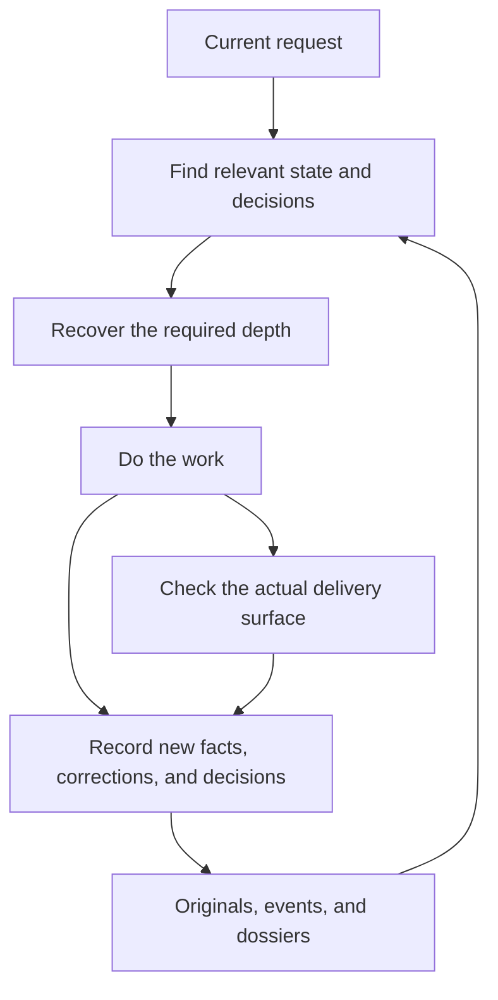
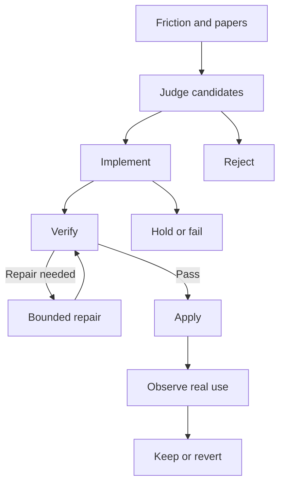

<!-- source: PRD-session-memory.ko.md sha256:93942220ec5851af2a6fc3af6428d94fbe7cd3036cda5d480921d09932cc2a1f source-of-truth: ko -->
# PRD — Memory for continuing and improving work

> **Status: current engine requirements, revised 2026-10-08.** This is not an implementation-complete declaration. Unmet requirements and observation methods belong in `design-memory-runtime.md#verification`.
> The Korean `.ko.md` is the source of truth. This English `.md` is a translation bound to that source's content hash.
> Role: what the user must be able to rely on when starting a session, returning to a deep thread, and improving the system autonomously.
> Claim authority and data boundaries belong in `PRD-info-architecture.ko.md`; technical structure belongs in `design-memory-runtime.md`.

## 1. Three situations the user needs supported

**A new session.** Start the next piece of work without asking the user to explain what is in progress or what has been decided. Indicate when local state is unavailable; do not claim complete knowledge from shared state alone.

**A return to a deep thread.** After working on something else, recover the previous conclusion, its reasons, rejected alternatives, and unresolved questions. Reading the dossier is not the endpoint: use it in the current answer and action.

**Autonomous improvement.** Review recurring friction and new research, test small changes, repair defects and revalidate, and check whether the changes actually helped. Continue this cycle without requiring a person to confirm every start, intermediate step, and completion.

The purpose is to reduce the user's effort to resume, judge, and act while completing the work. More memories, workers, papers, adoptions, or rules are not ends in themselves.

## 2. From conversation to outcome

Memory is evidence for answering the current question. Automatic injection is a small starting point that signals what exists; read originals and dossiers when needed. Isolated workers perform broad reading and verification, returning the results and evidence locations needed for judgment to the person and main session.

## 3. Recover state and depth

The state source of truth is the view combining public NOW with the local private overlay. Inspect the view actually received after session start, resume, or compaction. A path for reading state from disk must remain available when injection fails. Mark missing local state `unavailable`, partial errors `degraded`, and corruption explicitly. Generation time and source freshness are different.

The merged view is a derivative for current state, not the highest authority for every claim. Attribution to originals, current decisions, and execution facts follow the information PRD.

Designate one canonical dossier for each deep thread; an existing document may serve. It contains current position, decisions and their reasons, rejected options and their reasons, unresolved questions, and the next move, with a path back to the evidence. Read it on return and retrieve originals when needed. Before leaving, append a delta of at most five lines without deferring important decisions or corrections until the end.

## 4. Select memory relevant to the current question

Recall uses keywords, time, speaker, project, and source locations. Do not promote copied child-agent history, system injections, or compaction summaries to original user statements. Search scope and exclusions must be visible.

Read originals when the past statement itself is at issue. Bring in evidence relevant to the current work without always injecting unrelated full histories. Conversely, do not claim an exhaustive review is complete after a few targeted searches. Reading, finding, and using material in a judgment are distinct claims.

Keep always-on rules focused on important boundaries and recovery, and load the rest conditionally. The current seven are an operational default, not a universal limit on model ability. Before adding a rule, identify the failure it should prevent and overlap with existing rules. Fewer bullets do not necessarily mean fewer independent obligations.

Reproduce known failures of lexical search first. Compare embeddings, graphs, reranking, or other methods on the same queries and reading budget. Retain the existing reconsideration triggers: three known-item failures, demonstrated expression mismatch, reduced responsiveness, and increased cost of cross-linking. A triggered review is not automatic grounds to adopt a new method.

## 5. Close the improvement cycle through outcomes

Automatic execution is limited to the scope explicitly delegated by each instance. Installing the engine or adopting this PRD does not grant execution authority. This kit defines the following improvement contract but does not install weekly garden or paper application services by default. Before adding automatic execution, the owner must record permitted paths, protected paths, stop conditions, and whether local commits are authorized in the instance rules. Without delegation, stop at proposals and review. A report-only tool such as `wf_gardener.js` does not inherit another loop's execution authority.

Each candidate needs the actual failure it would change, the expected behavioral change, a comparison criterion, stop conditions, a reversible unit, and a follow-up observation time. A new paper's score is not evidence of an effect on our work. Use thinking lenses to expose assumptions and counterexamples; the presence of a section title does not earn a PASS for thinking quality.

Distinguish the following states.

| State | Meaning and next action |
|---|---|
| Idea rejected | Do not proceed because value, scope, or evidence is insufficient. Preserve the reason and conditions for reconsideration |
| Implementation needs repair | The goal remains valid, but the patch, artifact, test, or review has a defect. Incorporate feedback within the same specification |
| Insufficient evidence or execution held | Execution conditions or validation are insufficient. Do not mark a pass; resume when the condition is resolved |
| Repair budget exhausted | The defined attempts or time did not resolve the problem. Preserve the failure separately from rejection of the idea |
| Applied | A particular patch version passed validation and authorization boundaries and was incorporated |
| Effect observed or effect unknown | Whether the change helped in real work has been observed, or remains unknown |

**Repair contract:** implementation under the same specification and write-set has **one initial attempt and one feedback repair, at most two attempts in total**. Preserve attempt history and exhausted state. The runtime must not expand the budget or restart the same specification under a new candidate label. A goal or scope change is a separate judgment and does not erase previous failed attempts. Do not lower evaluation criteria to pass review. Do not reuse an earlier PASS without validation bound to the latest base and patch. After application, decide whether to keep, modify, or revert when no benefit or a harmful effect is observed.

Zero adoption can be valid. Having no candidates is different from every implementation failing. Examine results and causes separately through discovery, selection, implementation, validation, application, and real use. Do not impose an adoption quota. Report cycle completion separately from improvement.

## 6. Failure and when to involve a person

If recovery or state guidance fails, continue useful work and disclose the missing observations. Boundaries against private-data disclosure and unauthorized changes must fail closed. Do not apply one failure policy to every hook.

An instance that installs a watchdog checks required artifacts and delivery to the next stage, not just process registration and exit codes. Retries must prevent duplicate execution and infinite repetition. Leave discoverable evidence even when the watchdog itself fails. `--help` and explicitly read-only queries must not change state or perform healing.

When involving a person, present the one blocked decision, prepared alternatives, the current recommendation, and what would change with the answer. Do not seek approval again for delegated work. Continue reversible implementation and verification that do not need a person. Do not dump unrelated operational warnings on the user.

## 7. Verify completion and utility separately

| Claim to verify | Required observation |
|---|---|
| Records were preserved | Actual records and supersession relationships, valid scope and origin |
| Necessary evidence was found | Results for known-answer material, expression variation, and temporal-conflict queries |
| Evidence reached the session | Actual runtime injection path and comparisons with it enabled and disabled |
| Responses or behavior changed | Whether constraints, rejection reasons, and corrections were incorporated in the same real task |
| The work improved | Follow-up observations of repeated explanation, rework, judgment burden, and completion outcomes |

Retain the existing success criteria: recover three state questions in a new session with no repeated questions; detect reproduced stale claims; reduce manually updated state locations from five to two; recover prior depth through dossiers; keep ritual cost to one tool call; cap public NOW and SessionStart context each at 6,000 UTF-8 bytes; and cap a worker receipt at 4,096 UTF-8 bytes. Verify actual passage for the target version with observations. A document saying "implemented" or a historical audit table does not establish current passage.

The human map should reveal "what I need to do now," "where work is blocked," and "what evidence to check" within 60 seconds. Attach observation time, evidence, and unknowns to state. Distinguish hardcoded explanation from actual observation even in a generated diagram; generation does not guarantee consistency.

Observe recovery, retrieval, injection, behavior, and effect separately on the current version of the instance. Without comparative evidence, the result is UNKNOWN. Report tests of implemented parts separately from unobserved user utility, and do not lower existing targets to current implementation quality.

## 10.5 fresh bounded worker (KIT-DR-007)

This section is the **current contract** for byte and capability references in existing documents and decision records. Implementation is described in `design-memory-runtime.md#worker`.

- Isolate broad reading, audits, and cross-runtime discussion in fresh, ephemeral workers. Do not provide resume, runtime fallback, public trace landing, or a write-capable Claude adapter. The worker itself does not own a scheduler.
- The receipt returned to the main session is **at most 4,096 UTF-8 bytes**. Preserve the exact prompt snapshot, event stream, stderr, final result, and content hashes in a self-contained private run record under `_private/work/runs/`. Native session persistence is zero.
- Claude is **read-only (`Read|Glob|Grep`)**; Codex uses a **workspace-write sandbox**. Record capabilities in the receipt and metadata. Claude emitting an edit proposal is different from having file-write permission. State changes, sending, and committing belong to the dispatcher's authority.
- Both adapters disable connectors, web, command network access, configured plugins, and fan-out, and do not depend on hooks. Dispatch identifies AGENTS and the required public/local canonical paths. Claude uses safe mode and a strict empty MCP configuration; Codex ignores user configuration and disables the relevant features.
- Metadata v2 records `kit_rev`, `kit_rev_source`, `repo_rev`, `kit_dirty`, `engine_sha256`, `kit_sync`, `agents_sha256`, `harness_sha256`, `usage`, `read_scope`, and `scope`. Missing usage is null; an absent write-set check is unchecked. A scope violation changes run status only with `--strict-scope`. Do not describe post-hoc detection as prevention.
- A wave's aggregate receipt accepts at most eight runs, preserving input order, and totals at most 4,096 UTF-8 bytes. Each row includes run ID, verdict, evidence location, and unknowns. Do not turn an unreported value into an assertion of absence.

- Worktree output delivery must complete before cleanup. A failed or incomplete artifact capture returns exit 5 and preserves the worktree; termination during capture also preserves it. This failure takes precedence over strict-scope exit 4, while `scope.status` still records any scope violation. Read-material copies are not output artifacts.
- Provider credentials remain instance-owned. The worker environment removes the other provider's credential variables; saved Claude authentication is injected only into Claude. The environment policy is part of harness identity. `read_scope` is optional self-report and does not establish a read sandbox.

## 10.6 Current validity of instance pilots

Keep the start, end, and judgment of a manual pilot in the instance's decision records and experiment ledger. Preserve preconditions, input binding, observation surfaces, and stop conditions. A document revision does not automatically extend, promote, or retire a pilot. An expired pilot without an ending judgment remains unadjudicated; expiry is not a pass.

## Revisions and historical references

Use the corresponding Git version of this repository for earlier text, initial phases, and historical audits. Do not use a historical execution table as the current progress table, or promote a paper's numerical claim to a universal limit without rechecking the original.

Old sections 3.1 and 3.1.1 map to the information PRD's `#authority`; 3.2 through 3.3 to [recovery](#recovery); 3.4, 3.6, and 3.7 to [memory selection](#retrieval); 3.5 and 10.3 to [improvement](#improvement); 9 to the design's `#ownership`; 10.1 and 10.4 to [recovery](#recovery) and the design's `#runtime`; 11 to [verification and the map](#acceptance); and 12 to [improvement](#improvement) and [failure](#failure). Section 10.5 retains the current contract above. Resolve historical decision and debate line numbers against their corresponding version.
