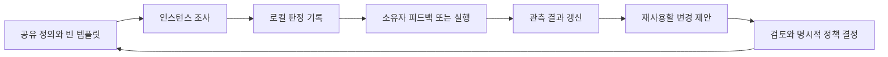

# 딥패스

소유자가 깊이를 요청할 때 쓴다. 모든 질문에 적용하지 않는다. 조사와 한계 공개를 돕는 절차이며, 칸을 채웠다고 답이 옳아지는 것은 아니다.

이 문서는 킷이 소유하는 계약이다. 인스턴스의 기록·선호·재검토 일정·과거 사례는 이 문서 밖에 둔다.
[기록 절](#recording)과 `system/instance-rules.md`에 선언된 경계를 따른다.

## 진행

작업에 맞게 단계를 합치거나 줄여도 된다. 아래 산출 다섯 칸은 유지하되 해당하지 않는 칸은 이유를
짧게 쓴다. 결과를 판단하는 데 필요한 근거와 결정을 보여준다. 모든 관점을 사람용 체크리스트로
펼치지는 않는다.

### 1. 문제 선언

질문·원하는 결과·작업의 실패를 알아볼 조건을 적는다. 다음 역할을 가른다.

| 역할 | 정하는 제약 |
|---|---|
| 독자 | 언어·설명·분량·다음 행동 |
| 승인자 | 통과 조건과 권한 |
| 수혜자 | 누구의 상황이 좋아져야 하는가 |
| 목적함수 | 실제로 최적화하는 결과. 어느 한 역할의 선호와 같지 않을 수 있다 |

새 이해관계자를 발견했다고 그에게 맞추기 전에 소유자의 실제 지시를 확인한다.

### 2. 근거 확인

대안을 만들기 전에 관련된 현재 파일을 읽는다. 주장 종류에 맞는 원점과 대조한다.

- 현재 결정: 유효한 결정 기록과 결정 저널.
- 논증 상태: 해당 스레드의 서류철.
- 현재 상태: public NOW와 사용 가능한 local overlay.
- 사건의 순서: 저널.
- 누가 무엇을 말했나: 원문 발화의 표적 조회.

근거의 기준 시점·접근할 수 없는 출처·관측이 낡아지는 조건을 밝힌다. 개입이 조사할 흔적을 지울 수
있으면 먼저 기준선을 보존한다. 과거 결정은 바뀔 수 있다. 무엇을 새로 알았고 왜 판정이 바뀌는지
남긴다.

### 3. 관점 선택

[사고렌즈 13종](lenses/README.md)은 질문의 씨앗 목록이다. 전수 체크리스트도 가능한 관점의 상한도
아니다. 적용할 렌즈의 정의를 먼저 읽는다. 즉석 관점도 같은 기준으로 고른다. 다른 반례·제약·답을
하나라도 더하는가?

이해관계자·시간 범위·실패 경로·동형 시스템·극한·독자·가장 강한 반대자를 후보로 삼을 수 있다.
같은 말을 하는 관점은 줄인다. 빠뜨린 관점이 결정을 제한한다면 그중 가장 중요한 것을 기록한다.

역할 토론에서는 각 역할에 판돈, 동일한 관련 근거, 입장 안의 긴장, 모른다고 답할 권한을 준다.
충돌하는 판정은 평균내지 않고 비교한다. 역할은 분석 도구이지 실재 인물의 증언이 아니다.
실재하는 사람의 선호·사적 마음·당사자 경험을 만들지 않는다. 기존 발화를 먼저 조회하고, 결정을
실제로 바꾸는 미지에 대해서만 묻는다. 답과 무관한 작업은 계속한다.

### 4. 유력한 답을 부수기

관련된 경계 사례, 반대가 참이면 나타날 관측, 끝까지 계산한 사례를 사용한다. 계산이나 테스트를
돌리기 전에 예측을 적는다. 제안한 검사가 맞지 않으면 이유를 쓴다. 공격으로 답이 바뀌었는지,
답이 버텼는지, 검사를 하지 않았는지 기록한다.

산출이 틀에 굳었다면 실제 연산을 바꿔 본다. 작은 사례를 계산하거나, 인과 경로를 그리거나,
익숙한 용어 없이 주장을 다시 구성한다. 유명 인물의 이름을 지워도 단계를 특정하고 재현할 수
있을 때만 작업법을 빌린다. 문체 변화는 근거가 아니다.

### 5. 판정

추천 하나를 고른다. 진 대안의 가장 강한 논점과 그 대안이 이길 조건도 남긴다. 원문 사실·제안·
미해결 가정을 구별한다.

### 6. 차가운 독자 시험

검토 전에 독자가 산출물만으로 답해야 할 질문 몇 개와 기대 답을 적는다. 새 맥락의 작업자에게
산출물과 독자·목적만 주고 질문에 답하게 한다. 독자의 첫 행동도 따라가게 한다. 구체적인 누락과
오독을 고치고 무엇이 바뀌었는지 남긴다. "좋아 보인다"는 이해도 결과가 아니다.

같은 계열 모델도 이 한정된 독자 시험을 할 수 있다. 독립된 뒷받침, 다른 검토 관점의 대체재,
인간에게 유용하다는 증명으로 세지 않는다. 새 독자를 쓸 수 없으면 그대로 밝힌다. 자기 검토의
이름을 바꿔 차가운 독자 시험이라고 하지 않는다.

### 7. 한계 공개와 판정 검토

발견한 결함·근거가 있는 강점·남은 미지를 쓴다. 자기 검토는 아는 한계를 공개하는 절차이지
독립적인 검증이 아니다.

되돌릴 수 없거나, 외부에 영향을 주거나, 비용이 크거나, 핵심 가정에 민감한 결정에는 자료와 도구가
허용하는 범위에서 위임된 적대 검토를 붙인다. 다른 모델 계열에 전략 가정 하나를 공격하고 가장
관련된 미구동 관점을 실제로 적용하도록 발주한다. [토론 계약](debate/README.md)을 따른다.
"판정을 바꿀 발견 없음"도 정당한 결과다.

다른 계열은 다른 오류를 드러낼 수 있지만 근거의 독립성을 보장하지 않는다. 합의는 원자료 대조·
실행·소유자 피드백을 대신하지 않는다. 같은 계열 검토는 그렇게 표시한다. 자료가 인스턴스 경계를
넘을 수 없으면 허용된 일반 질문으로 줄이거나 검토 불가로 남긴다. 이 절차는 새 반출·집행 권한을
부여하지 않는다.

## 산출 다섯 칸

1. 추천 하나.
2. 가장 강한 반대와 응답.
3. 버린 대안과 버린 이유.
4. 모르는 것.
5. 이 답이 뒤집힐 조건.

독자가 쓸 수 있게 쓴다. 칸을 채우려고 대안이나 비판을 만들지 않는다. 관점 범위와 검토 세부는
기록에 두고, 추천을 제한하는 중요한 미지는 추천에도 드러낸다.

## 기록과 후속 관측

[빈 원장 템플릿](../templates/deep-pass-ledger.md)을 인스턴스의 `_private/deep-pass/ledger.md`로
복사한 뒤 실제 적용을 기록한다. 이미 있으면 이어 쓰고 빈 템플릿으로 덮지 않는다. 인스턴스가 자체
규칙에 다른 보호된 위치를 정할 수 있다. 선택한 위치가 추적되는 엔진 파일 밖인지 확인한다.

딥패스 한 번에 기록 하나를 남긴다. 판정 유지와 단축 실행도 포함한다. 전체 패스 밖에서도 렌즈가
판정을 실제로 바꾼 결정은 기록할 수 있다. 후보·실제로 쓴 관점·전후 판정·정정 출처·후속 결과를
적고 고정된 로컬 ID로 연결한다. 처음 관측을 조용히 덮어쓰지 않고 정정을 덧붙인다.

인스턴스 사례를 렌즈 정의·이 문서·추적되는 템플릿에 쓰지 않는다. 익명으로 보여도 인스턴스의 데이터
국경을 따른다. 인스턴스 백업은 업스트림 엔진 업데이트와 별개다.

로컬에서 정한 시점이나 관련 사례가 쌓였을 때 절차를 재검토한다. 기록 누락·기각된 정정·관측 결과·
독자에게 드는 비용을 본다. 호출 수·주석 수·판정 변경 수는 범위 관측이지 효능 지표가 아니다.
정정이 없으면 이미 적절한 답이었을 수 있고, 기록된 실패가 없으면 관측 과정이 놓쳤을 수 있다.

다른 인스턴스의 파일럿 만기나 수치 합격선을 상속하지 않는다. 새 공유 규칙에는 막으려는 실패,
근거 범위, 비교 기준, 되돌릴 조건이 필요하다. 제안이 기록됐다는 이유로 엔진 정책이 되지는 않는다.
