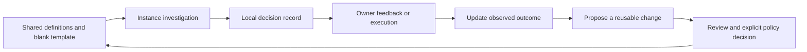

<!-- source: deep-pass.ko.md sha256:3cc07864f4b5037cc955305aa0efe9805d6df7a1af68d012eeaec30f330f1b38 source-of-truth: ko -->
Korean: `deep-pass.ko.md`

# Deep pass

Use this procedure when the owner requests depth. Do not apply it to every question. It organizes investigation and exposes limits; completing its fields does
not establish that an answer is correct.

This is a kit-owned contract. Instance records, preferences, review schedules, and historical cases belong
outside this document. See [recording](#recording) and the boundary declared in `system/instance-rules.md`.

## Procedure

Combine or shorten stages when the task permits. Keep the five output fields below, or explain briefly why
a field does not apply. Report the evidence and decisions needed to assess the result, without turning every
perspective into a user-facing checklist.

### 1. State the problem

Name the question, the intended result, and what would show that the work failed. Separate these roles:

| Role | What it constrains |
|---|---|
| Reader | Language, explanation, length, and next action |
| Approver | Acceptance conditions and authority |
| Beneficiary | Whose situation should improve |
| Objective | The outcome being optimized; it need not equal any one role's preference |

Confirm the owner's actual instructions before optimizing for a newly discovered stakeholder.

### 2. Establish the evidence

Read the relevant current files before generating alternatives. Match each claim to its authority:

- Current decision: the applicable decision record and decision journal.
- Argument state: the thread dossier.
- Current status: public NOW plus the available local overlay.
- Event order: the journal.
- Who said what: a targeted retrieval of the original statement.

State the evidence cutoff, unavailable sources, and conditions that would make an observation stale. Preserve
a baseline before an intervention that could erase the trace being investigated. A prior decision can change;
record the new evidence and why it changes the decision.

### 3. Select perspectives

The [13 lenses](lenses/README.md) are a seed library of questions, not a complete checklist or a limit on
possible perspectives. Read the definition of a lens before applying it. Consider task-specific perspectives
on the same terms: does each add a different counterexample, constraint, or possible answer?

Useful sources include affected parties, time horizons, failure modes, analogous systems, extreme cases,
the intended reader, and the strongest opponent. Drop duplicate perspectives. Record the most consequential
omitted perspective when it limits the decision.

For role-based discussion, give each role a stake, the same relevant evidence, a tension within its position,
and permission to say it does not know. Compare conflicting judgments instead of averaging them. A role is
an analytical device, not testimony from a real person. Never invent a real person's preferences, private
thoughts, or lived experience. Consult existing statements first; ask only about unresolved facts that
materially affect the decision, while continuing independent work.

### 4. Try to break the leading answer

Use the relevant boundary case, the observation predicted if the opposite were true, and a worked example.
Write the prediction before running a calculation or test. If a proposed check does not apply, explain why.
Record whether an attack changed the answer, the answer survived it, or the check was not run.

When the output has become formulaic, try changing the actual operation: calculate a smaller case, draw the
causal path, or reconstruct the claim without its familiar terminology. Borrow a method only when its steps
are identifiable and reproducible without invoking a famous person's name. A change of style is not evidence.

### 5. Decide

Choose one recommendation. Preserve the losing alternative's strongest argument and the condition under
which it would win. Separate source facts, proposals, and unresolved assumptions.

### 6. Test a fresh reader

Before review, write a few questions the intended reader should be able to answer from the artifact and the
expected answers. Give a fresh context only the artifact and its audience and purpose. Have it answer the
questions and walk through the reader's first action. Correct concrete omissions and misreadings; record
what changed. "Looks good" is not a comprehension result.

A same-family model can perform this limited reader test. It is not independent corroboration, a substitute
for a different review perspective, or proof that a human will find the result useful. When a fresh reader is
unavailable, say so; do not rename self-review as a fresh-reader test.

### 7. Disclose limits and review the decision

State discovered defects, supported strengths, and unresolved uncertainty. Self-review discloses known
limits; it does not independently validate the work.

For an irreversible, externally consequential, expensive, or assumption-sensitive decision, use an authorized
adversarial review when the material and available tools permit it. Ask a different model family to attack a
strategic assumption and work through the most relevant omitted perspective. Use the
[debate contract](debate/README.md). "No material change" is a valid result.

A different family may expose different errors but does not guarantee independent evidence. Agreement does
not replace source verification, execution, or owner feedback. A same-family review must be labeled as such.
If the material cannot cross the instance boundary, use a permitted generic question or record the review
as unavailable. This procedure grants no new export or action authority.

## Five output fields

1. One recommendation.
2. The strongest objection and the response to it.
3. Discarded alternatives and the reason for discarding them.
4. What remains unknown.
5. Conditions that would reverse the answer.

Keep these useful to the reader. Do not manufacture alternatives or criticism to fill a quota. Perspective
coverage and review details belong in the record, with material limitations visible in the recommendation.

## Recording and follow-up

Copy [the blank ledger template](../templates/deep-pass-ledger.md) to `_private/deep-pass/ledger.md` in the
instance before recording an application there. If it already exists, append to it; never replace it with
the blank template. An instance may declare another protected location in its own rules. Verify that the
chosen location stays outside tracked engine files.

Keep one record per deep pass, including unchanged judgments and shortened passes. A decision outside a
full pass can also be recorded when a lens materially changes it. Record the candidates considered, the
perspectives actually used, the before/after judgment, the source of each correction, and its later outcome.
Use a stable local ID. Add corrections without silently rewriting what was originally observed.

Never put instance cases into lens definitions, this document, or the tracked template. Follow the instance's
data boundary even when a case seems anonymous. Instance backup is separate from upstream engine updates.

Review the procedure at a locally chosen time or after relevant cases accumulate. Use missing records,
rejected corrections, observed outcomes, and the cost to the reader. Counts of invocations, comments, or
changed judgments are coverage observations, not efficacy measures. Lack of a correction can mean the
answer was already adequate; lack of a recorded failure can mean the observation process missed it.

Do not inherit another instance's pilot deadline or numerical success threshold. A new shared rule needs
its failure mechanism, evidence scope, comparison criterion, and reversal condition. Proposed changes do
not become engine policy merely because they were recorded.
