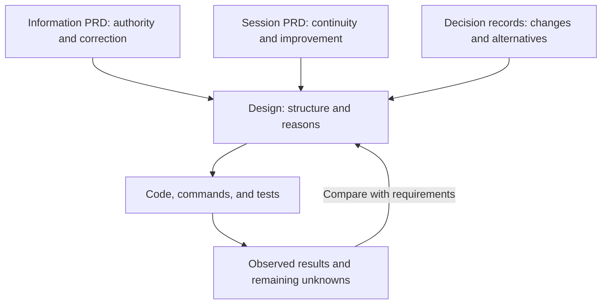
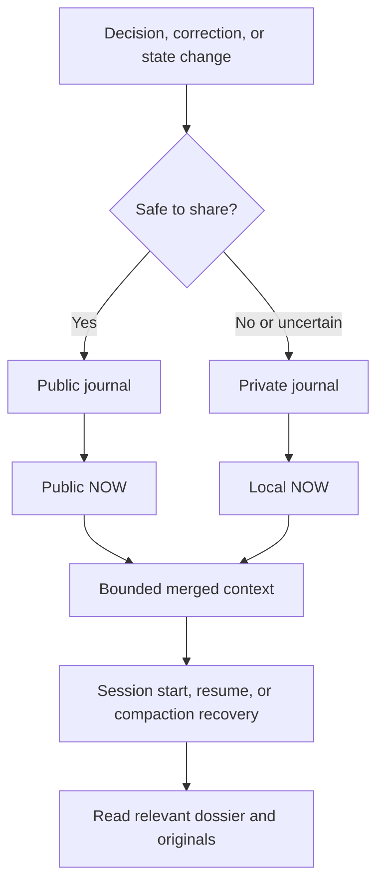
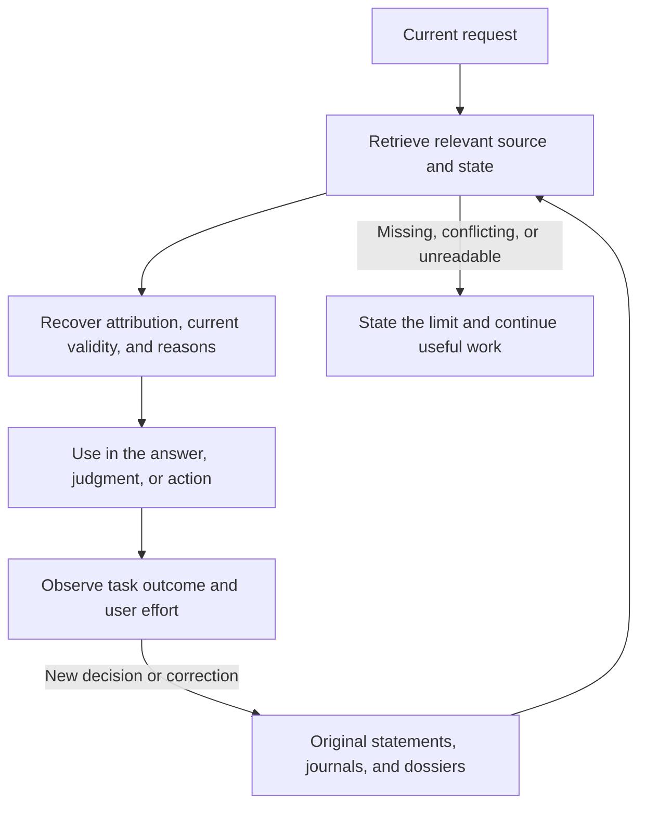
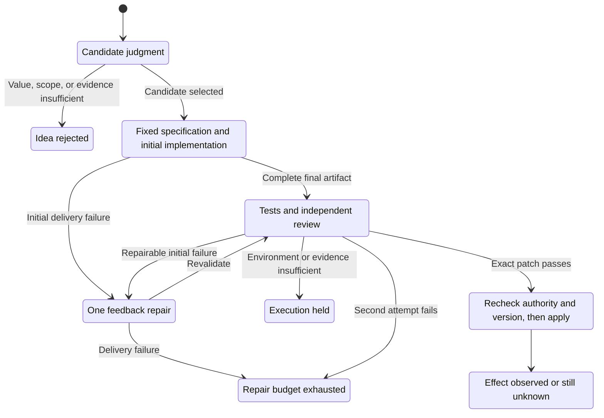

# Design: memory, execution, and improvement


Source comments and docstrings follow [Code and comments](code-writing.md): explain current behavior and necessary rationale locally; keep session history in decision or observation records.
Current design, 2026-10-08. This is a kit design document, authored in English. It connects requirements to
implementation and observations; it does not grant execution authority or certify an installed instance.
The two PRDs retain Korean source authority; their English translations are bound to the source content hashes.

<a id="purpose"></a>
## What this structure should save

A person returning to a task should not have to explain prior decisions, reconstruct rejected alternatives,
or correct the same mistake again. The goal is lower effort to resume, judge, and act while completing the
work. Memory volume, rule counts, and automatic changes are intermediate observations.

Always injecting the full history raises context cost; keeping only the current request loses earlier
decisions. This design combines a small current-state view with source records and dossiers opened when
needed. It keeps essential boundaries always active and loads other rules conditionally. Compare those
choices on real resumed tasks instead of treating retrieval counts or a universal rule limit as proof.

Improvement also needs both judgment and execution evidence. A report alone does not establish a correction;
an adoption quota encourages unnecessary changes. Distinguish idea value from implementation defects, allow
bounded repair, and revisit the design when observed user burden increases.

This Markdown document, including its diagrams, is the primary explanation. Use [retrieval](#retrieval) to
follow a resumed task, [improvement](#improvement) to understand a blocked change, and
[verification](#verification) to distinguish requirements from observations. HTML is a supporting view.

<a id="ownership"></a>
## 1. Ownership and entry points

A product requirements document (PRD) defines what must hold. This design explains how and why. Decision
records preserve changes and rejected alternatives; code and actual runs provide implementation evidence.



| Concern | Source of truth | Consumer |
|---|---|---|
| Claim authority, correction, and data boundaries | [Information PRD](PRD-info-architecture.ko.md) and instance rules | Records, documents, answers |
| Continuity and improvement requirements | [Session PRD](PRD-session-memory.ko.md) | This design and instance observations |
| State/configuration schema and visibility | [memlib.py](../tools/memlib.py) and instance configuration | NOW rendering and hook context |
| Fact schema and provenance | [rec.py](../tools/rec.py) | Search, hotset, audit chain |
| Transcript scope and speaker roles | [recall.py](../tools/recall.py) | Search slices and retrieval evaluation |
| Worker execution, receipt, and provenance | [fresh_worker.py](../tools/fresh_worker.py), PRD section 10.5 | Private run record and bounded receipt |
| Optional improvement adapters | Explicit instance delegation and adapter contract | Candidate judgment, patch validation, application |
| Engine updates | Upstream export review and [sync_engine.sh](../tools/sync_engine.sh) | Engine provenance, without instance data or authority |

Each module owns its schema. `memlib.py` is not the sole schema for every domain. A derived view reads those
sources instead of introducing another manually maintained registry. Requirements, code, and observations are
different forms of evidence.

The kit includes a manual gardener, described [below](#manual-garden). The paper application service,
watchdog, and loop scheduler are optional instance adapters, not installed by this document. An instance that
adds them must document its actual run, stop, status, schedule, authorization, and protected paths. An
upstream instance's delegation, cadence, switch, or successful run never transfers automatically.

<a id="state"></a>
## 2. Recording and restoring state

The journal records events. NOW is the derived current-state view. A dossier preserves a task's reasoning,
decisions, rejected options, open questions, and next move.



Preserve these requirements:

- Events outside the public-track allowlist and events marked `--private` stay local. Missing, corrupt, or
  incompatible configuration fails closed to local storage, with a warning that does not disclose raw data.
  Callers must mark private-derived events private even when their track is public.
- A later allowlist expansion does not publish old events retroactively. Preserve the legacy cutoff and its
  public set. Removing previously tracked material is a separate operation.
- Local dossier names and paths stay in the private thread registry. Invalid local entries produce a degraded
  status without suppressing valid public state. Private writes must not alter public journal or NOW bytes.
- Serialize append, fsync, render, temporary-file fsync, and atomic replace under the repository lock. Readers
  see a complete old or new snapshot. Bind publication to the renderer, configuration, registry, journal, and
  canonical inputs. A failed post-publication check restores prior snapshot bytes, mode, and mtime and
  reverses the associated append. Do not silently discard malformed events.
- Staged validation uses content identity rather than mtime. Distinguish source freshness from generation
  time. Live calendar-date freshness and elapsed-time age answer different questions.
- Public NOW and SessionStart additional context are each at most **6,000 UTF-8 bytes**. Keep the public/local
  minimum allocations and truncation indication. Unavailable or broken local state must be visible while
  valid public context remains usable.

Code: [now.py](../tools/now.py), [memlib.py](../tools/memlib.py). Regression entry points:
[test_state_runtime.py](../tools/test_state_runtime.py), [test_memlib_journal.py](../tools/test_memlib_journal.py).
Existing tests do not prove current dispatcher delivery or useful recovery in a real task.

<a id="retrieval"></a>
## 3. Retrieval and current meaning

Start from the claim: facts use rec, exact past statements use recall, reasoning uses a dossier, and current
progress uses NOW plus execution evidence. Do not rank all files on one universal authority ladder.



Keep source runtime, project, timestamp, and speaker role. Tool output, injected context, copied child-agent
history, and compaction summaries are not original user statements. Distinguish no match, absent source,
parser failure, filtering, ranking, and expression mismatch. A known-item failure requires independent reason
to believe the source item exists.

The hotset and dossier point to evidence and current decisions; they do not replace originals. Preserve
capacity, demotion, and supersession rules. Adding a storage format requires migration and regression checks.
Evaluate preservation, known-item retrieval, expression variation, current meaning, and behavioral use
separately. Compare absent context, the current method, and a candidate on the same real task and reading
budget. More hits alone do not establish a better answer.

Code: [rec.py](../tools/rec.py), [recall.py](../tools/recall.py), [eval_recall.py](../tools/eval_recall.py).
Regression entry points: [test_rec.py](../tools/test_rec.py), [test_recall.py](../tools/test_recall.py).
An optional thread-reentry adapter is not required to read a registered dossier or verify that its reasoning
appears in the resumed task.

<a id="runtime"></a>
## 4. Runtime delivery and effect

A configured hook or successful direct command establishes command validity, not dispatcher delivery.
Use positive and disabled-negative canaries in the actual runtime to verify model-visible injection. A model
finding the same state through another tool does not prove hook delivery. Recheck applicability after a model,
binary, or launch configuration changes.

Recovery observers expose errors and preserve useful work. Boundaries for disclosure and unauthorized
mutation fail closed. Do not give all hooks one blanket exit policy. Trace the combination of exception
handling and shell fallbacks so failures do not disappear.

Inspect runtime support with [hookdiag.py](../tools/hookdiag.py) and verify actual delivery with
[hook_canary.py](../tools/hook_canary.py). Direct sessions, wrapper sessions, and different runtimes may have
different support. Installation alone is not a positive canary.

The Claude canary requires empty tool and MCP inventories and zero model tool calls.
It permits only explicitly named runtime built-ins whose startup metadata identifies
both path and source as bundled. Configured, malformed, duplicate, or unknown plugins
fail the check. This distinguishes bundled runtime metadata from user plugin loading;
it does not claim the runtime contains no internal components.
Runtime-managed user configuration is outside the repository write-set check. An
ephemeral CLI session may still persist a project trust entry. When running disposable verification, record that side effect and remove only its own
temporary project entry afterward, preserving unrelated user settings. This is a
verification responsibility; the worker does not automatically edit user configuration.

<a id="worker"></a>
## 5. Fresh work and bounded return

The exact normative byte and capability contract remains in
[session PRD section 10.5](PRD-session-memory.ko.md#105-fresh-bounded-worker-kit-dr-007). This design does not
relax it. The dispatcher provides an exact prompt snapshot and declared read/write scope. Complete evidence
stays in a private run record; the bounded receipt points back to it.

For work that requires source material, distinguish the list of required paths from the contents actually
delivered. Bind the effective input snapshot to each required material's content hash. If a runtime cannot
read a file, supply its required contents in the input. Missing, unreadable, or truncated required material
must not silently count as a complete review. Delivery evidence and evidence of using the material in a
judgment are separate. This is a requirement; installation-specific verification remains necessary.

Preserve meta v2 provenance. Identify the source of `kit_rev`, distinguish an upstream source manifest from a
destination engine baseline, and bind `harness_sha256` to runtime, capabilities, contract prefix, options, and
disabled features. Missing usage is null. `read_scope` is a declaration, not proof of reading. Report write-set
prefixes, changes, violations, and status. Only `--strict-scope` turns a detected violation into run failure;
post-hoc detection is not prevention. Concurrent writes require isolation before attributing a diff.

Before deleting a worktree, preserve new or changed ignored outputs inside declared write prefixes.
Safe regular files go to the private run's `untracked/` directory and binary patch, with their
relative paths and SHA-256 values in worktree metadata. Read-material copies are excluded.
Hidden, credential-shaped, cache, linked, or otherwise unsafe ignored outputs are not exported.
An incomplete or failed capture returns exit 5 and preserves the worktree at `preserved_path`
for recovery. A termination signal during capture also leaves that worktree available;
normal runtime cancellation before capture keeps its existing cleanup behavior. Read
`capture_status`, `capture_skipped`, and `capture_error` before retrying;
a successful model process is not sufficient evidence of durable output delivery.

For an adapter that applies emitted edits, accept only **complete EDIT blocks in the final response**. Never
silently collect or combine earlier assistant segments. A missing or incomplete final artifact is delivery
failure, even if the stream contains a draft. A remaining bounded repair attempt requests the complete final
result. Read-only Claude can emit a proposal; only an authorized dispatcher can apply it.

Provider credential environment variables are separated for each runtime; an explicitly saved Claude
token is used only by the Claude adapter. The environment policy participates in harness identity.
`READ_SCOPE:` and `UNREAD:` are optional self-reports, not proof of filesystem confinement. Missing
declarations remain null. Material hashes and write-set checks answer different questions.

The optional status-map reader obtains report locations from the installed adapter's
`cycle_sources(root)` and calls `cycle_summary(path)`. Without that interface it reports UNAVAILABLE.
Public generation never imports the local reader. The current map UI is Korean and remains in the
translation-pending inventory.

Code: [fresh_worker.py](../tools/fresh_worker.py), [receipts.py](../tools/receipts.py),
[worker_batch.py](../tools/worker_batch.py). Regression entry points:
[test_fresh_worker.py](../tools/test_fresh_worker.py), [test_receipts.py](../tools/test_receipts.py),
[test_worker_batch.py](../tools/test_worker_batch.py).

<a id="improvement"></a>
## 6. Optional improvement adapters

This section is a requirement for an adapter an instance chooses to install. The kit does not, by itself,
install `papers_apply.py`, `loop_watchdog.py`, a scheduled research cycle, or an automatic commit switch.
Without explicit instance delegation, stop at proposals and review. Installation or PRD adoption never grants
automatic mutation, commit, push, or external-send authority.



Keep idea rejection, implementation defect, insufficient evidence or environment hold, repair exhaustion,
application, and observed effect separate. Zero adoption can be correct. It is different from every selected
implementation failing. Measure stages and causes; do not impose an adoption quota.

An implementation has at most **two attempts in total: one initial attempt and one feedback repair** under
the same specification and write-set. Persist attempt history and exhausted state across restarts. Do not
increase the budget dynamically or reset it by renaming the same candidate. A changed goal or scope needs
separate judgment and retains the earlier failure evidence.

Bind every attempt to specification, input, base revision, patch hash, validation, and review evidence. Check
base and candidate in isolation; preserve existing failures and require no new failures. Independent review
must validate the exact patch, status, exit code, and contract. Before application, recheck authority, switch
if present, HEAD, patch identity, and destination cleanliness under a lock. Never bypass hooks or weaken
review to obtain a pass.

Adapters must separately specify schedule and collection window, stop conditions, protected paths, rollback
unit, and follow-up observation. Read-only status and help commands must not heal, trigger work, notify, or
mutate records. The watchdog itself needs observable failure. Do not retry exhausted candidates forever.

An applied patch is not demonstrated user benefit. Tests, reviewer agreement, and commit existence do not
establish HELPED. Without real-task follow-up, effect remains UNKNOWN. Observe avoided errors, new friction,
regressions, rollbacks, and user intervention before deciding to keep, change, or revert.

<a id="manual-garden"></a>
### Manual memory audit

[wf_gardener.js](../tools/wf_gardener.js) is report-only. It produces proposals with evidence and risk; it does
not edit or commit. The calling session handles subsequent judgment under the instance's valid authority.
The `/garden` command still requires the owner's decision before follow-up execution. It does not inherit an
optional automatic adapter's authority. Confirm runner availability in the actual installation.

<a id="map"></a>
## 7. Markdown design and a supporting status view

Keep design and decision context in this Markdown document and the PRDs. Put Mermaid diagrams beside the
explanation they support and link to stable requirement anchors. Understanding the system must not require
opening a separate HTML artifact. The generated HTML view helps inspect current structure and operational
observations; it links back to these documents and source evidence.

Use the existing [build_memory_map.py](../tools/build_memory_map.py) generator. The following commands produce
the public architecture and the separate local view. Their output files are generated artifacts and need not
exist in a fresh clone. Verify support in the installed version before claiming that either output was created.

```sh
python3 tools/build_memory_map.py          # output: system/memory-map.html
python3 tools/build_memory_map.py --local  # output: _private/work/system-overview/index.html
```

The public map contains general structure and public observations. Private source material, cycle results,
and personal state stay in the local view. A renderer producing a file does not authorize its disclosure.
Distinguish a hardcoded explanation from a measured result. Use PASS, FAIL, UNKNOWN, or STALE with time,
version, source, and scope; missing data or a parser failure is UNKNOWN.

The first screen should let a reader identify the next personal action, the blocked stage, and the evidence
being relied on within 60 seconds. Verify actual desktop and narrow-screen layout, links, and clipping. A
fixture that generates valid HTML is not that reader test.

<a id="verification"></a>
## 8. Verification without transferred claims

Requirements stay active when unimplemented or unmeasured. Do not lower them to match current code. The
following table maps checks; it is not a test report. No originating instance's result is adopted here.

| Requirement | Claim | Status | Source | Test or observation | Last check |
|---|---|---|---|---|---|
| `#state` | Privacy, atomicity, and bounded context | Instance verification required | now/memlib | State and journal regressions; real runtime recovery | Not recorded here |
| `#retrieval` | Correct source and usable retrieval | Instance verification required | recall/rec | Known-item, paraphrase, time-conflict, and resumed-task cases | Not recorded here |
| `#runtime` | Dispatcher delivery | Instance verification required | hookdiag/hook_canary | Positive and disabled-negative runtime canaries | Not recorded here |
| `#worker` | Byte/capability contract and provenance | Instance verification required | fresh_worker/receipts | Worker and receipt regressions, boundary canary | Not recorded here |
| `#worker` | Required material, effective input snapshot, and content-hash binding | Instance verification required | Task input construction and fresh_worker | Missing, unreadable, truncated, and actually delivered material | Not recorded here |
| `#improvement` | Bounded repair and authorized application | Optional adapter, not included | Instance implementation | Repair-to-pass, reject/no-op, exhaustion, restart, stale-base cases | Not applicable until installed |
| `#map` | Public/local separation and readable delivery | Instance verification required | build_memory_map | Privacy fixtures and actual desktop/narrow-screen inspection | Not recorded here |
| PRD acceptance | Lower resume, judgment, and action cost | UNKNOWN without real-task evidence | User tasks and correction evidence | 20-question trial, 30-second provenance trace, recurrence and burden | Not recorded here |

An instance can record a dated six-field snapshot in its existing local run or report; a new parallel status
registry is unnecessary. Keep retrieval, storage, injection, behavior, and effect observations independent.
Code regressions cannot close the PRDs' real-user requirements.

<a id="migration"></a>
## 9. Document and language compatibility

The two PRD paths remain entry points. Their `.ko.md` files are normative Korean sources; their `.md` files
are complete English translations bound by the language inventory and source-hash stamps. Preserve fixed
anchors and the exact section 10.5 byte/capability link. A later source change makes the translation stale
until it is reviewed and rebound; a stamp alone does not establish translation quality.

Use fixed anchors in live references. Interpret historical section numbers against the Git version that
recorded them; do not rewrite old decisions. Engine policy belongs in kit decisions, while instance authority
and operational observations belong to that instance. Generalization requires semantic review as well as
name and path filtering.

The two PRDs and this design are kit-owned contracts, excluded from automatic source-instance document
export (`NOT_SYNCED`). A change to a shared requirement needs review in both repositories; copying a source
instance's text does not transfer its authority, schedule, or observations. Keep the shared section 10.5 body
and compatibility anchors equivalent. Engine code can still follow reviewed selective export, with manual
gardener references mapped to this document's existing `#manual-garden` entry.
